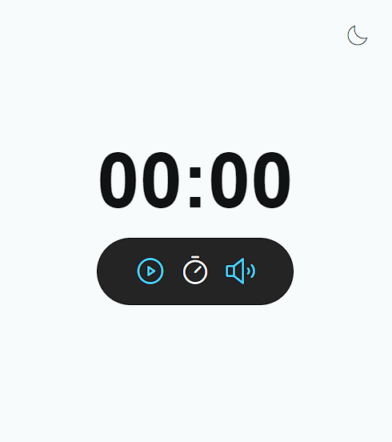

 
 

 

  
  

## 🖥️ Projeto

O projeto é um estudo de Javascript. 

## 🚀 Tecnologia

Esse projeto foi desennvolvido com as seguintes tecnologias:

- HTML
- CSS
- Javascript
- GIT e GITHUB

## 🏷️ Layout

Você pode visuzalizar o layout do projeto através 
[Desse link](https://www.figma.com/file/i9aT74NapZqVKtj8jX5y0n/Focus-Timer-V2-%E2%80%A2-Projeto-Explorer-(Community)?type=design&node-id=1422%3A28&mode=design&t=t5zKXwy63wVmjiQE-1).
É necessário ter uma conta no [Figma](https://www.figma.com)